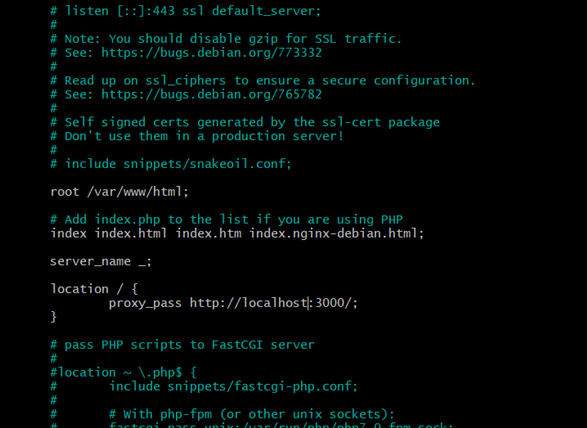

# Deploying and Automating

1. Always do the update and upgrade first.
2. we will need nginx so we have a web server
3. maybe need git if it isnt already installed
4. `curl -sL https://deb.nodesource.com/setup_12.x | sudo -E bash -` - This command is the version of node that we want. It is an older version which is no longer supported.
5. install node.js `sudo apt install nodejs -y`
6. `sudo npm install pm2 -g` node package manager pm2 runs node in the background
7. within the app directory `npm install` only works if nginx is running
8.  `npm start` or `node app.js`

Running and listening on port 3000

To allow the port (create a rule)
On portal azure - networking tab:
1. add inbound security rule
2. change port to 3000
3. protocol is TCP
4. add it

ctrl c to exit from listening -> More harsh than ctrl z.

ctrl z will close the terminal but carry on running in the background
- if you do this then kill it with kill -1 brute force
  
Only one thing can be running on a port. So two services cant use the same port. 

## Database VM

Steps to setup database:

1. Linux VM - Ubuntu 18.04 LTS
2. update and upgrade
3. install mongo db - version 3.2.x
   1. download key to get the right version
   2. source list - specify mongo db version
   3. update again
   4. install mongo db
4. configure mongo db to accept connections from app VM

Command steps:

    sudo apt update -y
    sudo apt upgrade -y
    wget -qO - https://www.mongodb.org/static/pgp/server-3.2.asc | sudo apt-key add -
    sudo apt update -y
    sudo apt-get install -y mongodb-org=3.2.20 mongodb-org-server=3.2.20 mongodb-org-shell=3.2.20 mongodb-org-mongos=3.2.20 mongodb-org-tools=3.2.20
    sudo nano /etc/mongod.conf

This will open up the mongo db configurations. The bind Ip is 127.0.0.1 which is local host. We want to open this up to any outside connections. To do this change it to 0.0.0.0 . This is for testing ONLY.

Then the next steps:

1. Check if it is running (it isnt)
2. Start mongodb
3. enable mongodb

Commands: 
    sudo systemctl status mongod
    sudo systemctl start mongod
    sudo systemctl enable mongod

## Connect app and database

Next you need to connect the app and the database.

On the app virtual machine you need to set up an environment variable.

    export DB_HOST=mongodb://<DB-IP-ADDRESS>:27017/posts #Example
    export DB_HOST=mongodb://20.162.216.139:27017/posts #Actual one I used
    npm install

We havent made a rule which allows things to connect to the app through this certain port.

So we need to add a new import rule in networking for the database to allow this port 27017.

Adding & would work the first time but then the second time you wouldnt be able to kill it as it would have a different process ID number.

## Adding in a reverse proxy server

To do this go in to /etc/nginx/sites-available

    sudo nano default

In here then add in the location / {}

     proxy_pass http://20.0.224.25:3000/;

    